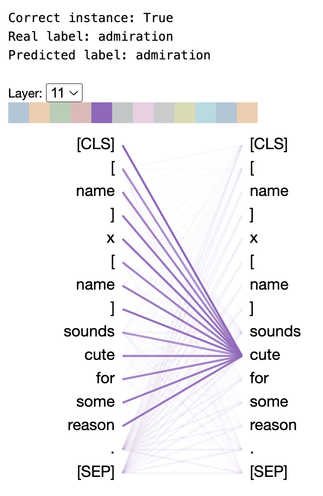
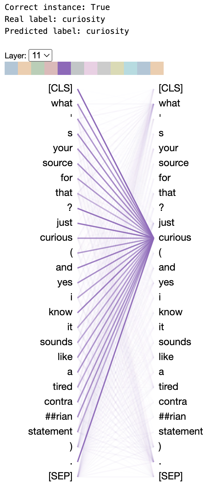
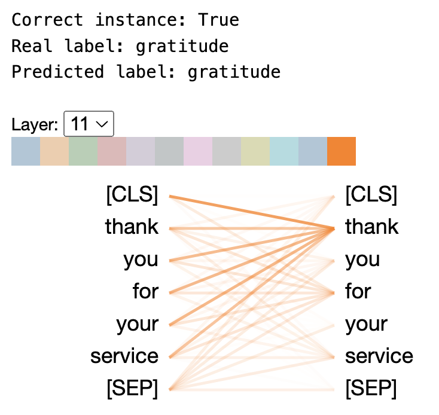
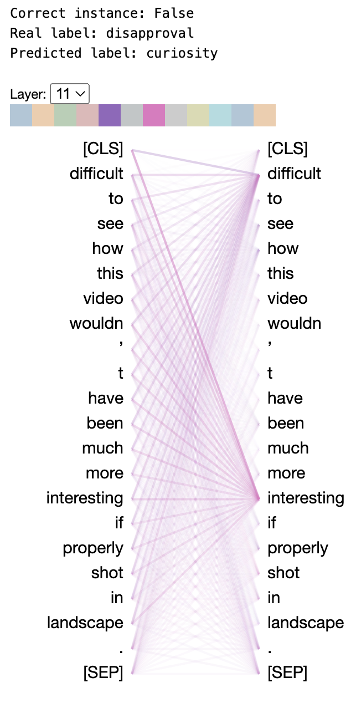
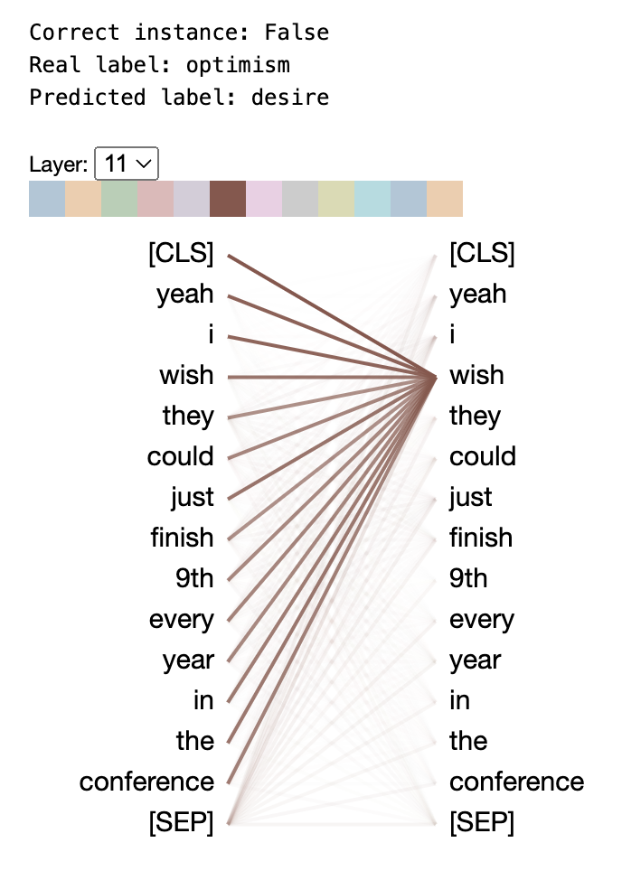
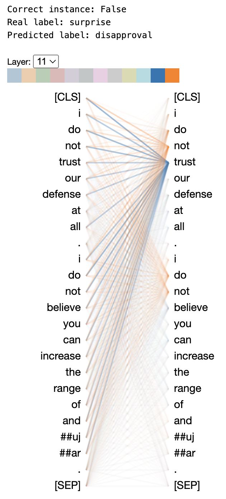

# COMP 551 A4

This repository contains code for a sentiment analysis model trained on the GoEmotions dataset using a base BERT (Bidirectional Encoder Representations from Transformers) model.

This model was produced as part of the fourth assignment in McGill's COMP 551 course "Applied Machine Learning."

In the [research report](../COMP_551_F2024_A4_updated_v3.pdf) included in this repository, this model is compared to GPT2 and Naive Bayes models, among others, to test its efficiency.

A range of training methods were used to balance training speed and performance, including head-only training and full-model training.

$~$

$~$

## Key Results:

- **Dataset:** GoEmotions, a corpus of 58k Reddit comments labeled with 28 emotion categories.
- **Models:**
  - **Naive Bayes:** Bag-of-words representation with tuned thresholds, Laplace smoothing, and normalization. Achieved 53.0% test accuracy.
  - **BERT:** Fine-tuned using HuggingFace's bert-base-uncased, with experiments on layer selection and hyperparameters. Achieved 61.6% test accuracy and improved interpretability via attention head visualization.
  - **GPT2:** Implemented as an extra experiment, achieving 61.0% test accuracy after fine-tuning.
  - **Baselines:** Random Forest, XGBoost, SGDClassifier, and ComplementNB, none exceeding 51.0% accuracy.
- **Analysis:**
  - Explores the impact of class imbalance, layer selection, and hyperparameter tuning.
  - Visualizes BERT attention heads to interpret model decisions.
  - Discusses the strengths and limitations of each approach, especially for rare emotion classes.

**Results:**

- BERT and GPT2 significantly outperform Naive Bayes and all baselines on the GoEmotions dataset.
- The work highlights the importance of pre-training, fine-tuning, and interpretability in sentiment analysis.

**Future Work:**

- Explore class weighting, regularization, and generalization to other sentiment datasets.

$~$

$~$

## Attention visualization

The following attention diagrams illustrate how the BERT model "thinks." Tokens on the right-hand column (output column) with many bold connections are more influential in decision-making. Note the similarities between predictions and these words.

#### Correctly predicted labels

#### Inorrectly predicted labels

$~$

$~$

## Technical

##### Steps to activate conda:

1. source ~/.bashrc
2. conda activate test_environment (use whatever environment name you want)
